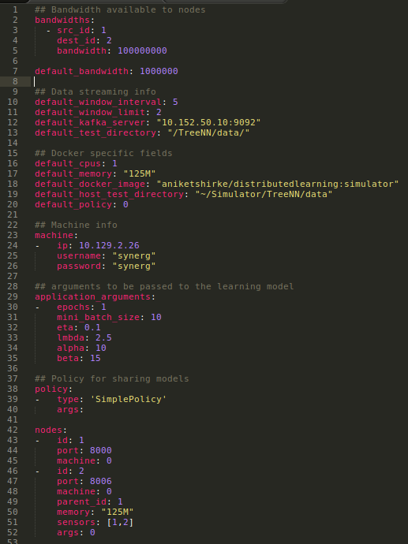

# Config



## Configuration fields
### Common fields for the hierarchy:
- Delays between nodes pairwise
- Default delay
- Default mini batch size for training (Field depends on the algorithm used)
- Default time interval (in seconds) for a window
- Default window limit for training
- Default epochs to be made on a window

### Fields for configuring nodes:
- Node id: Unique identification of a node
- IP address: address of the host on which the node will run as a container
- Port: Port for starting the RPC server
- Username of slave machine
- Password of slave machine
- test_directory: Accuracies will be calculated against each test file present in the directory
- Mini batch size (Optional)
- Time interval for a window (Optional)
- Window limit (Optional)
- Epochs per window (Optional)

## Link delays
Delays are sampled from a Gaussian distribution

1. tree.txt : Specify links for which delays are to be introduced
2. delays.yml : Output directed to this file

Run the following command:
```
python3 generate_link_delays.py -f tree.txt -m 1 -v 0.1
```

